<div align="center">

# ⚡ DataPulse AI

### Turn Any Dataset Into an AI-Powered Analytics Product in Under 5 Minutes

[](https://fastapi.tiangolo.com)
[](https://reactjs.org)
[](https://python.org)
[](https://datapulse-ai-six.vercel.app)
[](https://datapulse-ai-1t5i.onrender.com)

> Upload your data. Run the pipeline. Ask AI anything. Get insights in minutes — not days.


</div>

---

## 🎯 The Problem We Solve

Data analysts spend **80% of their time** cleaning, transforming, and preparing data — before any real analysis even begins. Generic AI tools like ChatGPT can *describe* what a pipeline should look like, but they can't actually *run* one on your data.


**DataPulse AI changes that.**

---

## ⚡ What Makes This Different From ChatGPT

| Capability | Generic AI (ChatGPT) | ⚡ DataPulse AI |
|------------|---------------------|----------------|
| Runs a real ETL pipeline on your file | ❌ | ✅ |
| Answers from YOUR data, not training data | ❌ | ✅ |
| Generates visual charts from real rows | ❌ | ✅ |
| Data quality scoring 0–100 | ❌ | ✅ |
| Detects your business domain automatically | ❌ | ✅ |
| Cloud storage via Azure Blob | ❌ | ✅ |
| RAG-powered retrieval from your dataset | ❌ | ✅ |
| Repeatable, schedulable pipeline runs | ❌ | ✅ |

---

## 🚀 Features

### 🏠 Landing Page
Beautiful product homepage explaining the full value proposition with domain detection, feature breakdown, and comparison table.

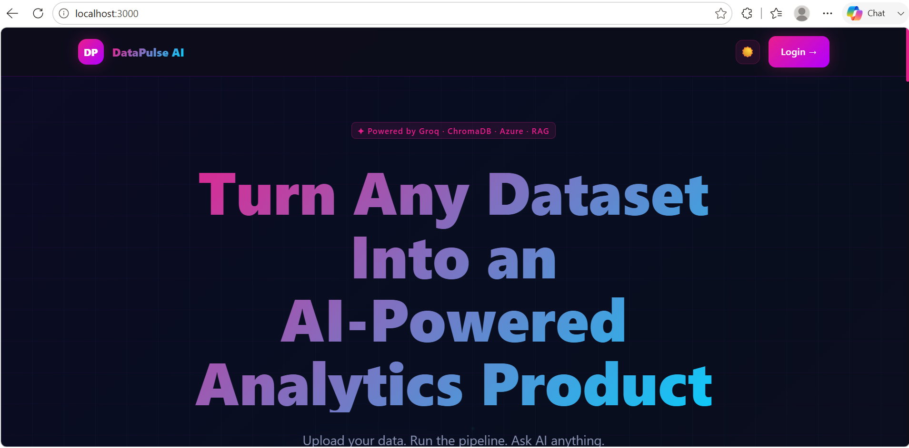
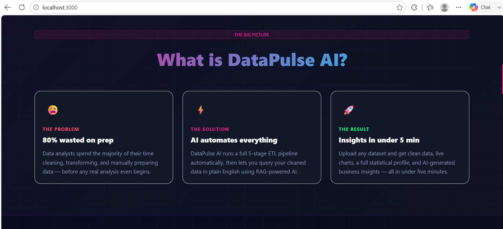
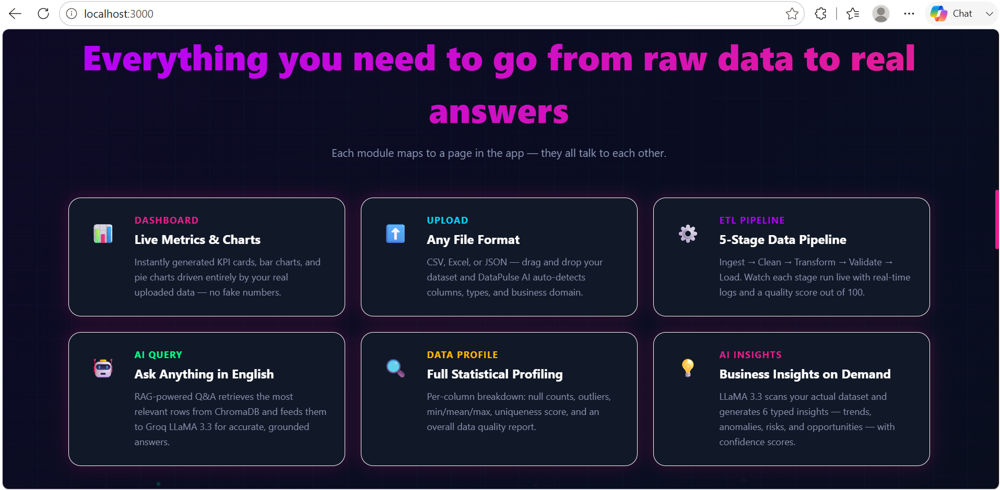

---

### 🔐 Authentication
Clean login flow with dark anime-themed UI. Demo mode — any credentials work.

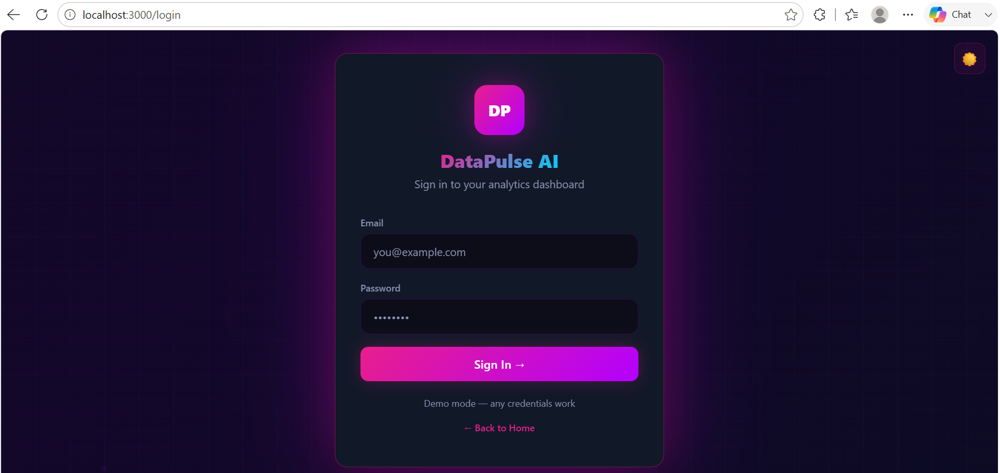

---

### 📤 Upload Dataset
Drag and drop any CSV, Excel, or JSON file. DataPulse AI auto-detects your columns, data types, and business domain in seconds.

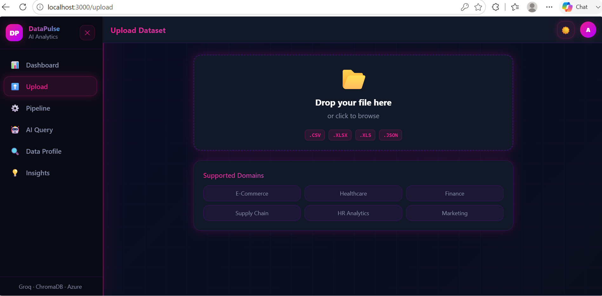

**Supported domains auto-detected:**
- 🛒 E-Commerce · 🏥 Healthcare · 💰 Finance
- 🚚 Supply Chain · 👥 HR Analytics · 📣 Marketing

---

### 🔄 5-Stage ETL Pipeline
Watch your data transform in real time across 5 enterprise-grade stages with live logs and a data quality score out of 100.

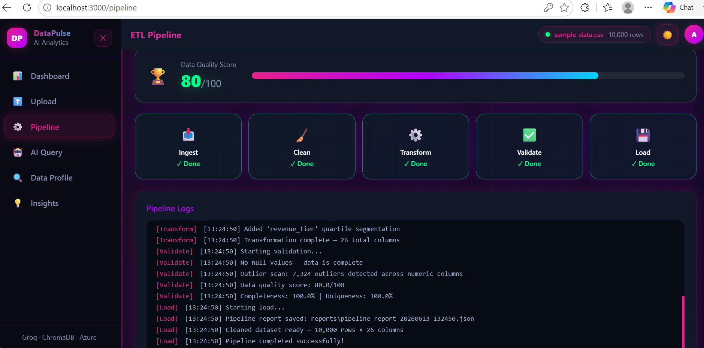

```
Stage 1: Ingest    → Read CSV/Excel/JSON, detect encoding
Stage 2: Clean     → Remove nulls, duplicates, fix types
Stage 3: Transform → Feature engineering, normalization, aggregations
Stage 4: Validate  → Schema checks, outlier detection, quality scoring
Stage 5: Load      → Save cleaned data, generate pipeline report
```

---

### 📊 Live Dashboard
Real-time KPI metrics, bar charts, pie charts, and AI-generated insights — all driven entirely by your actual uploaded data. Zero fake numbers.

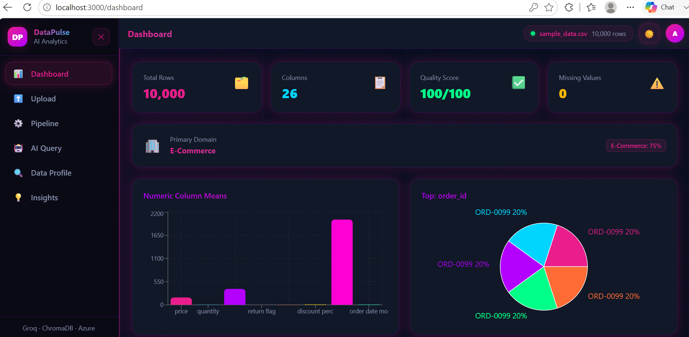
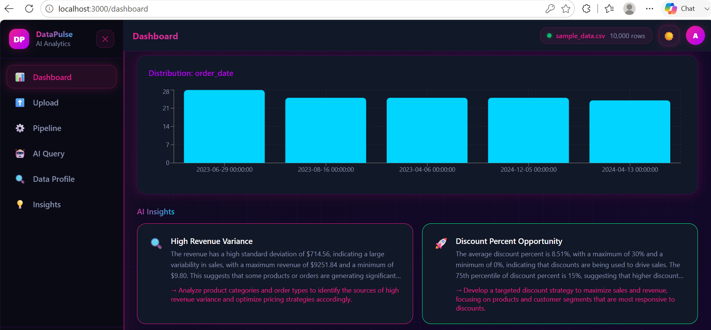

---

### 🤖 AI Query (RAG-Powered)
Ask questions about your data in plain English. DataPulse AI retrieves the most relevant rows from ChromaDB and feeds them to Groq LLaMA 3.3 for grounded, accurate answers with confidence scores.

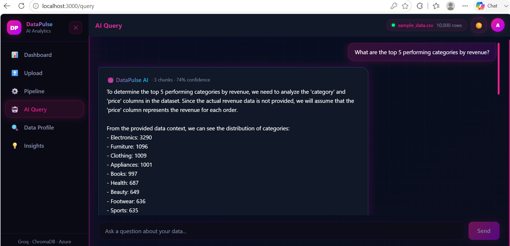

> *"What are the top 5 performing categories by revenue?"*
> → DataPulse AI answers from YOUR actual data rows, not generic knowledge.

---

### 🔍 Data Profile
Full statistical summary of every column — data types, null counts, min/mean/max, uniqueness scores, outlier counts, and an overall data quality report.

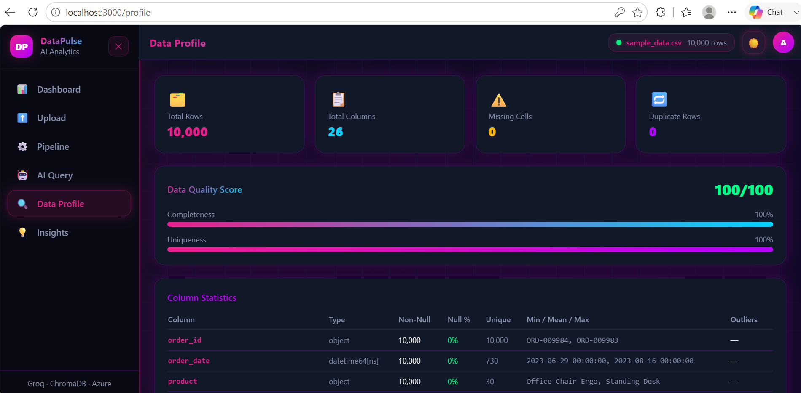
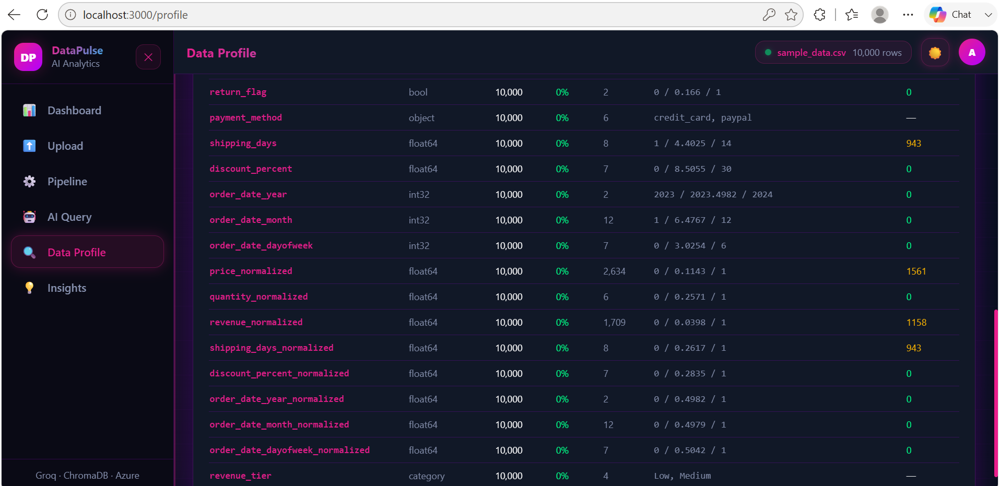

---

### 💡 AI Insights
Groq LLaMA 3.3 scans your entire cleaned dataset and generates typed business insights — patterns, opportunities, risks, and trends — each with a confidence score and recommended action.

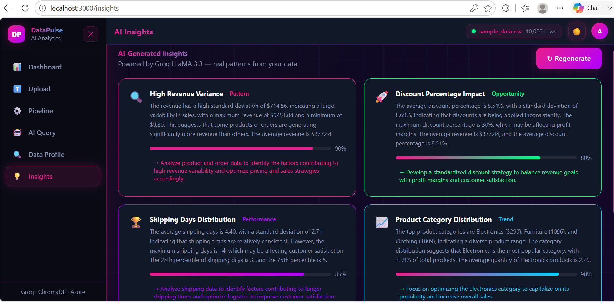

---

## 🛠️ Tech Stack

| Layer | Technology | Purpose |
|-------|-----------|---------|
| **Frontend** | React 18 + Vite | UI & routing |
| **Styling** | TailwindCSS | Anime dark theme |
| **Charts** | Recharts | Data visualization |
| **Backend** | FastAPI + Python 3.10 | REST API |
| **AI/LLM** | Groq (LLaMA 3.3 70B) | AI query & insights |
| **RAG** | ChromaDB + sentence-transformers | Vector search |
| **Pipeline** | Pandas + NumPy + scikit-learn | ETL processing |
| **Cloud** | Azure Blob Storage | Data persistence |
| **Deployment** | Vercel + Railway | Frontend + Backend |

---

## 🌍 Works Across Every Industry

DataPulse AI reads your column names and automatically identifies which industry your data belongs to:

| Domain | Example Columns Detected | Use Cases |
|--------|------------------------|-----------|
| 🛒 E-Commerce | order_id, revenue, category | Sales trends, LTV, returns |
| 🏥 Healthcare | patient_id, diagnosis, outcome | Readmission, drug trials |
| 💰 Finance | transaction_id, amount, fraud | Risk models, portfolio |
| 🚚 Supply Chain | shipment_id, delay, supplier | Inventory, performance |
| 👥 HR Analytics | employee_id, attrition, tenure | Churn, hiring funnels |
| 📣 Marketing | campaign_id, CAC, conversion | ROI, attribution |

---

## 📡 API Reference

| Method | Endpoint | Description |
|--------|----------|-------------|
| `POST` | `/upload` | Upload CSV/Excel/JSON dataset |
| `POST` | `/pipeline/run` | Run full 5-stage ETL pipeline |
| `POST` | `/query` | RAG-powered AI query on your data |
| `GET` | `/insights` | Generate AI business insights |
| `GET` | `/profile` | Full statistical data profile |
| `GET` | `/pipeline/status` | Real-time pipeline stage status |
| `GET` | `/domains` | Auto-detected business domains |

---

## ⚡ Quick Start

### Prerequisites
- Python 3.10+
- Node.js 18+
- Free Groq API key → [console.groq.com](https://console.groq.com)

### Installation

```bash
# 1. Clone the repo
git clone https://github.com/shiny-github/datapulse-ai.git
cd datapulse-ai

# 2. Add your API key
echo "GROQ_API_KEY=your_key_here" > .env

# 3. Install backend dependencies
cd backend
pip install -r requirements.txt

# 4. Start backend (Terminal 1)
python -m uvicorn main:app --reload --port 8000

# 5. Install & start frontend (Terminal 2)
cd ../frontend
npm install
npm run dev

# 6. Open http://localhost:3000
# Any credentials work in demo mode
```

### Windows One-Click Start
```bash
# Double-click start.bat in the root folder
```

---

## 🏗️ Project Structure

```
datapulse-ai/
├── backend/
│   ├── main.py              # FastAPI server + all endpoints
│   ├── pipeline.py          # 5-stage ETL pipeline engine
│   ├── rag.py               # ChromaDB RAG system
│   ├── azure_integration.py # Azure Blob Storage
│   └── requirements.txt
├── frontend/
│   └── src/
│       ├── pages/
│       │   ├── Home.jsx     # Landing page
│       │   ├── Login.jsx    # Auth page
│       │   ├── Dashboard.jsx
│       │   ├── Upload.jsx
│       │   ├── Pipeline.jsx
│       │   ├── AIQuery.jsx
│       │   ├── DataProfile.jsx
│       │   └── Insights.jsx
│       └── components/
│           ├── Sidebar.jsx
│           └── Header.jsx
├── data/
│   └── sample_data.csv      # 10,000 row e-commerce dataset
├── .env                     # API keys (not committed)
└── README.md
```

---

## 👩‍💻 Built By

**Ananya Katram**
Data Analytics Enthusiast · MS Computer Science, UT Arlington

[](https://www.linkedin.com/in/ananya-katram/)
[](https://github.com/shiny-github)

---

<div align="center">

### ⭐ If this project helped you, please star the repo!

*It helps other developers find it and motivates continued development.*

</div>
